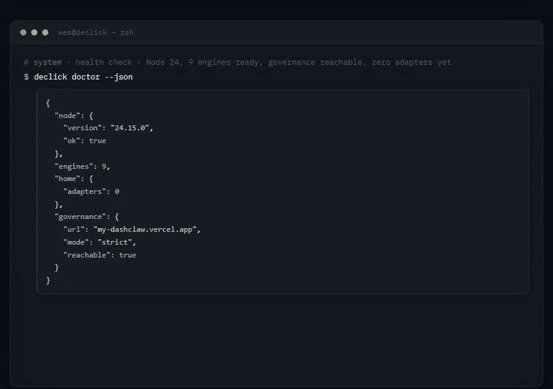

# declick

Stop writing a parser for every tool your agent calls. declick reads a source once and writes named verbs that return one envelope with five exit codes. Nine engines, zero runtime dependencies, Node 24.

[](https://www.npmjs.com/package/declick)
[](https://github.com/ucsandman/declick/actions/workflows/ci.yml)
[](https://nodejs.org)
[](LICENSE)



## Quickstart

Requires Node 24 or newer. An older Node exits 1 with one line naming the version it found, from either entry point, instead of a stack trace.

```
npm i -g declick
declick add https://petstore3.swagger.io/api/v3/openapi.json --name petstore
declick run petstore describe
declick run petstore get-user-by-name user1 --fields username,email
declick run petstore get-pet-by-id 7 --dry-run
```

The fourth line is a real call: petstore's user endpoints declare no auth, so the envelope comes back with the row. `get-pet-by-id` declares an API key in the spec, so without `PETSTORE_API_KEY` set it exits 4 and names the key; `--dry-run` shows the request it would send instead.

`declick add` writes three things: `~/.declick/petstore/manifest.json` (the compiled surface), `~/.declick/bin/petstore` (a two line launcher, with a `petstore.cmd` twin on Windows), and a `petstore/SKILL.md` in each agent skills directory it knows about, so agents discover it without being told. It also writes declick's own skill next to it, so an agent that finds one adapter knows how to build the next.

`declick run <name> <verb>` works everywhere with no setup. Once `~/.declick/bin` is on PATH (`declick path --install` does it for new shells, `declick doctor` tells you whether it is), the short form `petstore get-pet-by-id 7` works too. Both forms have identical output and exit codes.

## Why

Every time an agent reads a screenshot or a DOM to find a button, it pays in tokens and latency, and it pays again in the next session because nothing was learned. declick compiles the surface once and replays it deterministically: a spec, an app window, or a server becomes a set of named verbs with stable output. The point is not the conversion. It is that every generated CLI honors the same output contract no matter which engine produced it, and that declick itself honors it too, so an agent never has to leave the shell.

## Engines

Every engine is built in, with zero runtime dependencies. `declick engines` lists them and `declick engines --source <x>` says which one a source would land on before anything is written.

| Engine | Source |
|---|---|
| openapi | `spec.json`, `spec.yaml`, `https://.../openapi.json` (openapi 3 and swagger 2, json or yaml, through a built-in YAML parser) |
| postman | `collection.json` (postman v2.1), `insomnia.json` (v4 export) |
| har | `capture.har` from a browser network capture; `--host api.example.com` picks the API host |
| graphql | `graphql:https://.../graphql`, `schema.json`, `schema.graphql`; `--url` gives a schema file its endpoint |
| mcp | `mcp:<command args>` for stdio servers, `mcp:https://host/mcp` for streamable http |
| sqlite | `sqlite:<path>` or `data.db`: tables and views become list/get/insert/update/delete plus a parameterized `query` |
| cli | `cli:<binary> [fixed args]`, compiled from the tool's own `--help` |
| web | `web:https://<site> --recipes <dir>`: a real browser over CDP, and a miss returns the elements that are there instead of a screenshot |
| desktop | `app:<window title>` on Windows through [deskclaw](https://github.com/ucsandman/deskclaw) UI Automation. `declick engines` reports it as not ready, Windows only, on any other platform |

A spec-shaped URL (`.json`, `.yaml`, `openapi`, `swagger`, `api-docs` in the path) routes to the openapi engine even when the `openapi` key is not in the first 64 KB, which is the case for large specs that list `components` first. A spec URL that answers 404 fails naming the status (`GET <url> -> 404`), and a plain page URL is told it is not a spec rather than compiled as one.

## The output contract

Every generated adapter, and every `declick` command, follows this:

| Guarantee | Detail |
|---|---|
| `<name> describe` | Whole surface in under 2000 characters, about 500 tokens. Verbs, one line purpose, required args, base URL or window. A surface over the 2000 char ceiling pages itself: the page ends with a footer naming how many verbs are left, the total, and the flags that reach them (`--grep text`, `--offset N`, `--limit N`, `--verb v`). `--full` adds flag detail plus a `->` line showing each verb's compiled `returns` (shape and field names, or the `--rows` path), `--json` gives the same as data (`verbs[].returns` is always present there, `null` when the spec has no response schema). |
| `--json` | Default when stdout is not a TTY. Success: `{ok:true, data, meta:{count, truncated}}`. Failure: `{ok:false, error, exit}` plus `data` when the engine has a payload (an API error body, a desktop tree diff). `--json false` forces text. |
| `--fields a,b` | Project only named fields, dotted paths allowed (`--fields error.code,items.0.name`), resolved per row. Applies to top-level arrays and objects. A field list that matches nothing anywhere is exit 1 naming the available keys; a partial miss shows up in `meta.unknownFields`. |
| `--limit N` | Cap list output. Default 50. Must be a positive integer; anything else, including `0`, is exit 1. |
| `--rows path` | Unwrap a dotted array field inside a response object instead of projecting the object itself. `meta.rows` names the path, `meta.extra` carries the sibling fields (cursor, total, etc). Without `--rows`, a verb whose compiled `returns.rowsPath` names one is auto-unwrapped only when `--fields` or `--limit` is passed, so an unfiltered call returns the resource as the API sent it; `rowsPath` is compiled only for a list-shaped property, and `describe`/`manifest`/management output is never auto-unwrapped. |
| `--dry-run` | Every mutating verb accepts it, prints what it would do, and sets `meta.dryRun: true`. Management commands that write (`add`, `build`, `accept`, `import`, `skill`, `remove`, `path --install`, `desk arm\|disarm`) accept it too; `author`, `repair` and `ui` have no preview and refuse it. |
| Flags | `--flag value` and `--flag=value` both work. Boolean flags (`--json`, `--dry-run`, `--full`, `--help`) never consume the next argument, so order does not matter. Unknown flags are exit 1, never ignored. `--` ends flags. |
| Request flags | Verbs on the engines that speak HTTP (openapi, postman, har) also take `--header 'K: V'` (repeatable), `--base-url <url>` or `--server <index\|description>` (or `DECLICK_<NAME>_BASE_URL`), `--content-type <type>` to pick among the declared body types, `--body @file` / `--body-file <path>` / `--body -` for stdin, `--output <path>` for a binary response, `--retry N` and `--timeout <ms>`, `--verbose` (`meta.request`, `meta.response`, `meta.status`) and `--curl` (a runnable line with every secret masked as its env name). `describe --full` lists them. Each takes a value, so a bare `--retry` is exit 1, not a silent default. |
| Exit codes | 0 ok, 1 error, 2 not found (adapter, verb, window or element), 3 blocked (governance, deskclaw unarmed or STOP), 4 auth needed. |
| Mutating flag | The manifest marks each verb `mutating: true/false`. The runtime and the authoring replay route mutating verbs through the DashClaw guard when `DASHCLAW_API_KEY` is set (see Governance). With no key set they run normally, nothing is written to stderr, and the envelope records `governance: {enabled: false, decision: "skipped", reason: "no guard configured"}`. |
| Auth | The manifest names required env keys only. At runtime declick reads `process.env` first, then `~/.creds/vault.env` (`CREDS_VAULT` overrides), for just those names. `declick auth <name>` reports which keys are present and from where. Secrets never land in a manifest. |
| SKILL.md | Generated from the manifest: when to use, the describe output, three runnable examples, the `declick run` fallback, the exit codes that apply to that engine. Never overwrites a skill declick did not write. |
| Lint | `declick lint <name>` fails the build on: describe over 2000 chars, duplicate or reserved verb names (`describe`), flags or args that collide with the contract flags, descriptions over 80 chars or spanning lines, a relative or templated base URL, a path parameter with no arg, an invalid desktop recipe, or a value that looks like a secret. A failed build prints the first eight errors and a count of the rest. |

## Works with any agent

declick is a command line tool, so the integration is the shell. `declick add` writes the adapter's `SKILL.md` into every agent skills directory that exists on the machine. `~/.claude/skills` (Claude Code) is always written; `~/.codex/skills` (Codex), `~/.hermes/skills` (Hermes), `~/.openclaw/skills` (OpenClaw) and `~/.agents/skills` are written when the directory is already there. It never creates a directory for an agent you do not have, and `DECLICK_SKILLS` names any other list, comma separated. An agent without a skills directory reads `declick describe <name>`, or you paste `declick skill <name> --print` into its AGENTS.md or system prompt.

A custom agent on the Anthropic SDK, the OpenAI SDK, or Anthropic Managed Agents needs one tool: run `declick run <adapter> <verb> [args] --json` and hand back stdout. The envelope is the tool result, the exit code is the status, and `describe --json` is the source for the tool's input schema. Nothing in that loop is specific to a model or a vendor. Governance is optional in the same way: with no DashClaw key set, mutating verbs run and nothing blocks.

```js
import { execFile } from 'node:child_process';
import { fileURLToPath } from 'node:url';
import { promisify } from 'node:util';
const bin = fileURLToPath(import.meta.resolve('declick/bin/declick.mjs'));

// The one tool an SDK agent needs. The envelope is the result, on success and on failure.
export async function declick(adapter, verb, args = []) {
  const r = await promisify(execFile)(process.execPath, [bin, 'run', adapter, verb, ...args, '--json']).catch(e => e);
  return JSON.parse(r.stdout);
}
```

That is source, not captured output: `npm i declick` in the agent's project, then this function. Run on Node 24 against the published package, it returned the rows for `list-notes` on an mcp adapter and the exit 2 envelope for an unknown verb, with no shell involved.

## Compared with

- **Runtime REST clients such as restish** are built for a person at a keyboard: shorthand syntax, colored output, one API configured at a time. declick is built for a program: one envelope, five exit codes, a `describe` an agent can afford to read, and the same shape for a database or a window as for an API.
- **SDK generators such as openapi-generator and Speakeasy** produce a typed client library per language. The CLI on top, the output shaping and the exit codes are still yours to write. declick skips the library and writes the CLI.
- **MCP** gives an agent tools over a protocol, which needs an MCP client in the loop. The mcp engine compiles a server into shell verbs, so an agent with only a shell uses it, and `--fields` and `--limit` cut the result before it reaches the context window.
- **Screenshot and DOM agents** find the button again every session and pay tokens each time. The web and desktop engines record the path once and replay it, and a miss returns the elements that are there, not a screenshot.

The part none of those share is that all nine engines, and declick itself, honor the same contract, so an agent learns the output shape once.

## Governance

The guard is [DashClaw](https://github.com/ucsandman/DashClaw), the approval and policy layer for unattended agents from the same author: it intercepts a risky action before it runs and blocks it, or asks a person to approve it from anywhere, with one click. declick talks to it over one HTTP call per mutating verb. Nothing below is required. With no key set, a mutating verb runs, nothing is written to stderr, and the envelope records `governance.enabled` false with the reason `no guard configured`. Site: [dashclaw.io](https://www.dashclaw.io).

Set `DASHCLAW_API_KEY` and `DASHCLAW_URL` (no default endpoint; `DASHCLAW_URL` must be set alongside the key, https unless the host is loopback) and every real mutating call (runtime and authoring replay) posts `{tool, action, risk_score, method, target, args}` to `<DASHCLAW_URL>/api/guard` with a 3 second timeout (`DASHCLAW_TIMEOUT_MS`). `args` is redacted first: anything secret-shaped becomes `<redacted>`, everything else is truncated at 64 chars. Risk scores: DELETE 70, PUT and PATCH 55, POST 45, desktop 60.

Once `DASHCLAW_API_KEY` is set, **strict is the default**: a guard that is unreachable, times out, blocks, or answers anything but a decision is exit 3. Set `DECLICK_GUARD=open` to fall back to warn-and-proceed on a guard failure instead (a `block` or `require_approval` decision the guard actually returns is still refused either way). `require_approval` exits 3 and carries `data.approvalId`. Every envelope, ok or not, carries `meta.governance: {enabled, decision, reason}` (`decision` is one of `allow`, `warn`, `block`, `require_approval`, `skipped` (no key set), `dry-run`, or `failed-open`).

Every invocation through `bin/run.mjs` appends one line to `~/.declick/audit.jsonl` (newest-last on disk, `declick audit` reads it newest-first): adapter, verb, mutating, dryRun, the governance decision, exit code and duration. `DECLICK_AUDIT=off` turns this off.

Credentials are scoped to the origin the adapter was built from: a request that goes to a different host than the one stored at build time (via `--base-url`/`--server` or an env override) does not get that adapter's keys unless the target name is listed in `DECLICK_ENV_ALLOW` (comma-separated) or the origin change was explicit on the command line, and either way `meta.credentials[]` records `{name, from, scopedTo, sentTo}` so the cross-origin release is visible in the envelope, not just a warning on stderr.

`declick ui` mints a random per-start token (`X-Declick-Token`) and every mutating POST from the page must echo it back (401 otherwise); `repair` and `add --goal` are refused with 403 unless the server was started with `--allow-authoring`. Mutating UI routes go through the same guard as the CLI.

## Windows apps

deskclaw is a PowerShell layer over .NET UI Automation that can snapshot a window into a tree of `@eN` element refs and act on them. declick 0.3 needs deskclaw 0.3.0 or newer (`desk --version`) for the attributed snapshot lines (`value=`, `toggle=`, `selected=`, `expanded=`, `offscreen=`) that the richer recipe steps read. Acting is gated: `declick desk arm 15` opens a window of a few minutes, an unarmed acting call and a STOP file both surface as declick exit 3, and `declick desk status` shows both switches. declick does not modify deskclaw. It shells out to it.

A recipe is a list of deterministic steps with no model in the loop at replay time. Elements are located by a path of `ControlType:Name` segments matched against a fresh snapshot with backtracking, never by screen coordinates. Hand-written recipes work (`declick add app:Notepad --recipes fixtures/notepad`; a single `.json` file or `-` for stdin with `--verb` also work, and every recipe is validated before it is stored). The normal path is to let Claude write one:

```
declick desk arm 15
declick add app:Calculator --name calculator --goal "multiply two numbers and return the display" --verb multiply
declick run calculator multiply Three Four
```

`declick add --goal` runs one bounded Claude Code session (sonnet) that may only read the window tree through deskclaw. It proposes a recipe with an `example` and an `expect` regex. declick dry-runs the recipe to prove every element path resolves, routes the live replay through the governance guard when the recipe is mutating, replays it once for real, and saves it only when the returned value matches `expect`. A rejected proposal is kept at `~/.declick/<name>/proposals/<verb>.json`; `declick proposals <name>` lists them and `declick accept <name> <verb>` promotes one after you fix it. Nothing else changes.

`declick author <name> --goal "..."` adds a verb to an existing adapter. `declick repair <name> <verb>` runs the same loop seeded with the recipe and the tree diff from the last exit 2, which the runtime writes to `~/.declick/<name>/last-error.json` and `declick status <name>` shows. Requires the Claude Code CLI on PATH (`DECLICK_CLAUDE` overrides; `DECLICK_AUTHOR_TIMEOUT_MS` bounds the session, default 300000). The authoring session receives an allowlisted environment, never `ANTHROPIC_API_KEY` or your other keys.

When the app changes, replay does not guess. The missing path exits 2 and the envelope carries a diff of the recorded tree against the live one, so the failure is legible instead of a silent misclick. A window that is not open is reported as exactly that, with no repair suggested. A recipe placeholder that is not a declared arg is exit 1 before anything is clicked.

The full recipe step vocabulary, a worked recipe, the tree-diff envelope, the manifest field reference and every environment variable are in [docs/REFERENCE.md](docs/REFERENCE.md).

## declick ui

```
declick ui --open
```

One local page at `http://127.0.0.1:4870` (127.0.0.1 only): every adapter, its engine and verb count, the last run and result, an add form, and build, repair, remove buttons per row. Repair is enabled when the runtime has recorded an element miss for that adapter. Buttons run the same `declick` commands you would type. The server refuses requests whose Host or Origin is not its own, so a web page you happen to have open cannot drive it. It prints `{url, port, token, allowAuthoring}` on stdout.

## Everything is a command

An agent with only a shell can do all of this. Every command takes `--json` and returns the envelope above.

| Command | What it gives you |
|---|---|
| `declick doctor` | node version, home, whether `~/.declick/bin` is on PATH (with the fix), skill dirs, vault, deskclaw presence and arm state, `claude` on PATH, governance config, engine readiness. `blocking` and `warnings` are separate lists and `healthy` is true only when `blocking` is empty, so a fresh home with nothing on PATH is healthy with one warning. Exit 1 only when node is too old. |
| `declick list` | every adapter: engine, source, verb names, auth keys, last run, last error. A corrupt manifest is one broken row, not a crash. |
| `declick describe <n> [--full] [--verb v] [--grep text] [--offset N] [--limit N]` | the surface as text or data, paged instead of printed whole when it is large |
| `declick manifest <n> [--verb v]` | the compiled contract: http method, path, query, body props, or recipe steps |
| `declick run <n> <verb> [args] [--flags]` | invoke a verb without touching PATH |
| `declick status [<n>]` | last run, last error with the tree diff, pending proposals, stored recipes |
| `declick auth <n>` | which env keys are missing and where present ones came from; exit 4 when any is missing |
| `declick add <source> --name n [--verbs a,b \| --tag t] [--engine e] [--host h] [--url u] [--force] [--dry-run]` | build from any source in the engine table above; `--verbs` or `--tag` subsets a large spec, `--engine` overrides detection, `--host` picks the API host in a HAR capture, `--url` gives a GraphQL schema file its endpoint, `--force` overwrites a launcher or skill name collision (a name that already resolves on PATH, such as `calc` on Windows, is refused without it), `--dry-run` compiles and lints without writing (refused for `--goal` authoring, which has no preview) |
| `declick build <n> [--dry-run]` / `declick lint <n>` / `declick skill [<n>] [--print] [--force] [--dry-run]` | recompile from the stored source, check the contract, regenerate SKILL.md without refetching; `--print` writes one adapter's SKILL.md text to stdout instead of disk, `--dry-run` lists the paths it would write |
| `declick remove <n> [<verb>] [--force] [--dry-run]` | delete the manifest, the launcher and the skill, or just one verb. Removing a verb exits 2 if it does not exist, exit 1 if the adapter is not desktop-engine (its verbs come from the spec, not per-verb files) or if it is the last recipe without `--force`; deleting the last verb removes the whole adapter (`adapterRemoved: true`). `--dry-run` previews what would be deleted. |
| `declick export <n>` / `declick import [<file>\|-] [--force] [--dry-run]` | a JSON bundle of manifest plus recipes that rebuilds on another machine through lint. `import` reads `export`'s envelope as it comes, so `declick export petstore \| declick import -` round-trips. It refuses to replace an adapter of the same name whose `source`, `engine` or `baseUrl` differs (`data.diff`) unless `--force`; the write is transactional, rolling back only what that import created on failure. `--dry-run` validates and previews without writing. |
| `declick engines [--source x]` / `declick version` / `declick path [--install] [--dry-run]` | which engines this build has and what a source would compile to, which build, where things are; `--dry-run` on `path --install` previews without touching PATH |
| `declick author`, `repair`, `proposals`, `accept [--dry-run]`, `recipes`, `recipe`, `desk status \| arm [min] \| disarm [--dry-run]` | the desktop authoring loop; `author` and `repair` have no `--dry-run` preview |
| `declick commands` / `declick <cmd> --help` | the whole command surface as data, and one row (flags, examples, whether it previews) for one command. The shipped `declick` skill is rendered from the same table, so it cannot drift. |
| `declick audit [--adapter n] [--since 10m] [--failed]` | one line per invocation from `~/.declick/audit.jsonl`, newest first: what ran, what governance decided, redacted args |
| `declick desk windows \| tree <window> \| read <window> <path> \| clipboard get\|set \| arm [min] \| disarm` | the desktop as data: `tree` takes `--depth N`, `--type Button`, `--grep re`, `--interactive`; `read` takes `--prop value\|name\|text\|toggle\|selected\|enabled` |
| `declick web tree <url> [--selector css]` | a page as a tree of elements a recipe can click, interactive ones first, instead of a screenshot |
| `declick import --example [--engine e]` / `declick manifest --schema` | a minimal valid bundle, and the manifest field reference as data |
| `declick ui [--port N] [--open] [--allow-authoring]` | the human page |

## Roadmap

Not yet shipped: compose verbs (chain several verbs into one), `batch --each` (run a verb over a list of inputs), local policy files (governance rules without a DashClaw server), a macOS/Linux desktop backend (deskclaw is Windows only), SSE streaming responses, and per-adapter flag defaults.

## Development

```
npm test
```

Zero runtime dependencies, zero dev dependencies. Tests are `node --test`; 490 pass on 0.3.2. The CI matrix runs `npm test` on Windows, Linux and macOS for every push and pull request.

`npm run qa` (`scripts/qa-real-specs.sh`, bash) is the release gate the suite cannot replace: it compiles six public specs (Stripe JSON and YAML, GitHub, Openverse, api.weather.gov, petstore3 YAML) from their live URLs, makes real keyless calls, checks the exit 4 path, `path --install` in a fresh login shell, the web page refusal, and the Node guard. Run it on Linux and macOS before every tag; `QA_FROM_NPM=1` runs it against the published package instead of the checkout.

From a clean clone:

```
git clone https://github.com/ucsandman/declick && cd declick
npm test
node bin/declick.mjs add fixtures/petstore.json --name petstore
node bin/declick.mjs run petstore get-pet-by-id 7 --dry-run
```

The suite passes whether or not `~/.declick/bin` is on PATH. A launcher declick wrote is recognized as its own, so after `declick path --install` the collision guard no longer reads those launchers as an existing binary of the same name.

The desktop live tests drive real windows, so they are opt in:

```
declick desk arm 15
DECLICK_LIVE=1 npm run test:live
declick desk disarm
```

Without `DECLICK_LIVE=1` they report as skipped rather than passing on no work.

## Releases

Bump `version` in package.json and add a CHANGELOG entry, then `git tag v0.x.y && git push --tags`. The publish workflow runs the tests and publishes with provenance.

## License

0.3.0 on npm is MIT. Releases after 0.3.0 are under the Elastic License 2.0: read it, run it, change it, ship it inside your own product; do not offer it to others as a managed service. Commercial licenses for teams and production support are requested at https://declick.dev.
